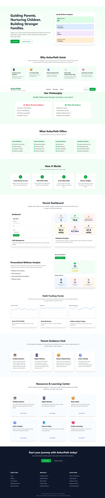
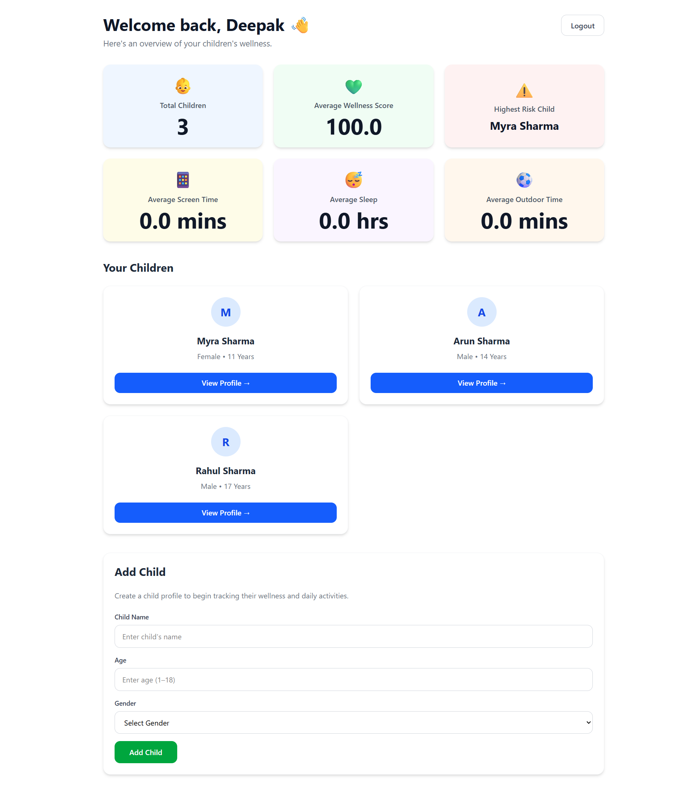
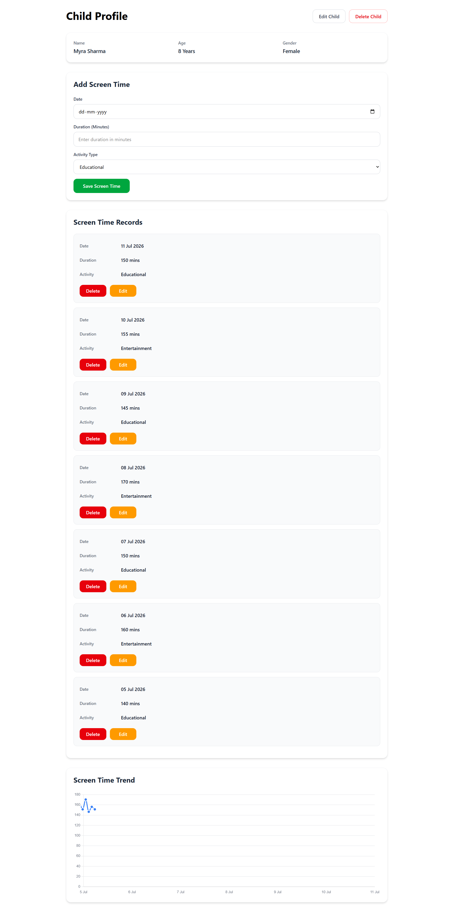
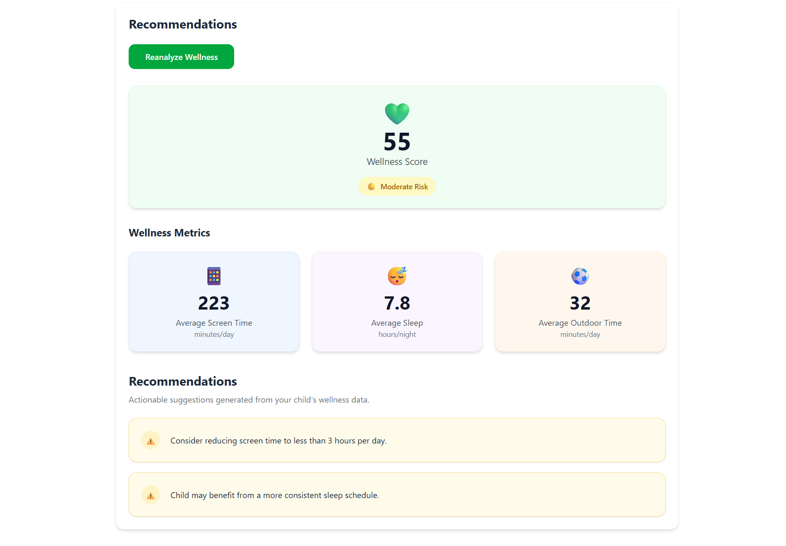

# 🌱 AnkurPath

A modern MERN-based parenting wellness platform designed to help families build healthier daily habits through evidence-informed insights.

An evidence-informed parenting decision-support platform that helps parents monitor children's healthy habits, identify wellness risks, and receive meaningful recommendations to support healthy childhood development.

---

## 📖 Project Overview

AnkurPath is a full-stack MERN application designed to help parents monitor important aspects of their children's daily lifestyle, including screen time, sleep, and outdoor activities.

Based on this data, the platform calculates a wellness score, identifies potential risk levels, and generates personalized recommendations to encourage healthier habits.

The platform is intended to support informed parenting decisions and encourage healthy childhood development. It is **not** a replacement for professional medical advice.

---

## 📑 Table of Contents

- [Project Overview](#-project-overview)
- [Problem Statement](#-problem-statement)
- [Features](#-features)
- [Tech Stack](#-tech-stack)
- [Architecture](#-architecture)
- [Project Structure](#-project-structure)
- [Installation](#-installation)
- [API Overview](#-api-overview)
- [Screenshots](#-screenshots)
- [Future Enhancements](#-future-enhancements)
- [Documentation](#-documentation)
- [Contributing](#-contributing)
- [License](#-license)
- [Author](#-author)

---

## 🎯 Problem Statement

Modern lifestyles have significantly increased children's screen exposure while reducing physical activity and affecting healthy sleep habits.

Parents often lack a simple way to monitor these lifestyle factors together and understand their combined impact on their child's overall well-being.

AnkurPath addresses this challenge by providing one centralized platform for tracking healthy habits and generating evidence-informed wellness recommendations.

---

## ✨ Features

### 👤 Authentication

- User Registration
- User Login
- JWT-based Authentication
- Protected Routes

### 👶 Child Management

- Add Child Profile
- Edit Child Profile
- Delete Child Profile
- View Child Information

### 📱 Screen Time Tracking

- Record Daily Screen Time
- View Screen Time History
- Visualize Trends with Charts

### 😴 Sleep Tracking

- Record Daily Sleep Duration
- View Sleep History
- Sleep Analytics Charts

### 🌳 Outdoor Activity Tracking

- Record Outdoor Activity Duration
- View Activity History
- Outdoor Activity Charts

### 🧠 Recommendation Engine

- Wellness Score Calculation
- Risk Level Assessment
- Personalized Recommendations
- Data Availability Warnings

### 📊 Dashboard

- Parent Dashboard
- Overall Wellness Insights
- Child Summary Cards
- Highest Risk Child Indicator

---

## 🛠 Tech Stack

### Frontend

- React.js
- Vite
- React Router DOM
- Axios
- Chart.js
- React Chart.js 2
- Tailwind CSS

### Backend

- Node.js
- Express.js
- JWT (JSON Web Token)
- bcryptjs

### Database

- MongoDB Atlas
- Mongoose

### Development Tools

- Git & GitHub
- VS Code / Cursor
- Postman

---

## 🏗 Architecture

AnkurPath follows a client-server architecture using the MERN stack.

- **Frontend:** React application responsible for the user interface and user interactions.
- **Backend:** Express.js REST API handling authentication, business logic, and recommendations.
- **Database:** MongoDB stores users, children, screen time, sleep, and outdoor activity records.
- **Authentication:** JWT-based authentication with protected routes and Axios request interceptors.

---

## 📂 Project Structure

```text
AnkurPath/
├── backend/
│   ├── src/
│   │   ├── config/
│   │   ├── controllers/
│   │   ├── middleware/
│   │   ├── models/
│   │   ├── routes/
│   │   ├── services/
│   │   └── utils/
│   ├── .env.example
│   ├── package.json
│   └── server.js
│
├── docs/
│   ├── API.md
│   ├── Database.md
│   ├── FutureEnhancements.md
│   ├── PRD.md
│   ├── Roadmap.md
│   └── UI.md
│
├── frontend/
│   ├── public/
│   ├── src/
│   │   ├── assets/
│   │   ├── components/
│   │   ├── context/
│   │   ├── hooks/
│   │   ├── layouts/
│   │   ├── pages/
│   │   ├── routes/
│   │   ├── services/
│   │   ├── styles/
│   │   ├── utils/
│   │   ├── App.jsx
│   │   └── main.jsx
│   ├── package.json
│   └── vite.config.js
│
├── .editorconfig
├── .gitignore
├── .prettierignore
├── .prettierrc
└── README.md
```

---

## 🚀 Installation

### 1. Clone the repository

```bash
git clone https://github.com/sidRanjanprog/AnkurPath.git
cd AnkurPath
```

### 2. Install dependencies

Backend

```bash
cd backend
npm install
```

Frontend

```bash
cd ../frontend
npm install
```

### 3. Configure environment variables

Create a `.env` file inside the `backend` directory using the provided `.env.example` file.

```env
PORT=5000
MONGO_URI=your_mongodb_connection_string
JWT_SECRET=your_jwt_secret
```

### 4. Start the backend server

```bash
cd backend
npm run dev
```

### 5. Start the frontend application

Open another terminal.

```bash
cd frontend
npm run dev
```

Frontend

```text
http://localhost:5173
```

Backend

```text
http://localhost:5000
```

---

## 🔗 API Overview

The backend exposes RESTful APIs for authentication, child management, activity tracking, dashboard insights, and recommendation generation.

| Method | Endpoint | Description |
|---------|----------|-------------|
| POST | `/api/auth/register` | Register a new user |
| POST | `/api/auth/login` | Authenticate user |
| GET | `/api/children` | Get all children |
| POST | `/api/children` | Create child profile |
| PUT | `/api/children/:id` | Update child profile |
| DELETE | `/api/children/:id` | Delete child profile |
| GET | `/api/recommendations/:childId` | Get personalized recommendations |
| GET | `/api/dashboard/insights` | Get dashboard insights |

---

## 📸 Screenshots

### Landing Page



---

### Dashboard



---

### Child Profile



---

### Recommendations



---

## 🔮 Future Enhancements

The following ideas are planned for future versions of AnkurPath:

- Nutrition Tracking
- Growth Tracking
- Weekly Wellness Reports
- AI Parent Coach
- Multiple Child Analytics
- Data Export
- Notification & Reminder System
- Multi-language Support
- Mobile Application

---

## 📚 Documentation

Additional project documentation is available in the `docs/` directory to provide deeper insights into the project's design, architecture, and development process.

| Document | Description |
|----------|-------------|
| PRD.md | Product Requirements Document |
| API.md | Backend API Documentation |
| Database.md | Database Schema and Design |
| UI.md | User Interface Documentation |
| Roadmap.md | Project Development Roadmap |
| FutureEnhancements.md | Planned Version 2 Features |

---

## 🤝 Contributing

Contributions, suggestions, and feedback are welcome.

If you would like to improve AnkurPath:

1. Fork the repository.
2. Create a new feature branch.
3. Commit your changes.
4. Open a Pull Request.

---

## 📄 License

This project is licensed under the MIT License.

---

## 👨‍💻 Author

**Siddharth Ranjan**

Built as a full-stack MERN project with a strong emphasis on clean architecture, maintainable code, and an intuitive user experience.
